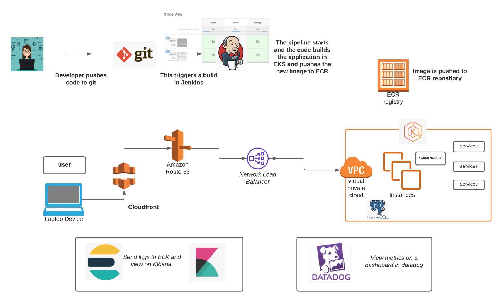

# air_quality_api-deployment
air_quality_api deployment for mycar

# infrastructure

1. Air quality api will be deployed on EKS production cluster.
2. It will be deployed as an Helm package.
3. the script to deploy wordpress will be in a Git and the build will be Jenkins.
4. postgres will built as an AWS Managed Service.
5. Postgres will be created via terraform that is also in our repo and will be built in the Jenkins file.
6. postgres will have periodic snapshots taken for backups which is also written into the code.
7. nginx ingress controller will be deployed as dependancies for this project.
8. The Cert cluster issuer will be letsencrypt.

# Monitoring

1. monitoring will be done via datadog synthetics checks
2. there will also be a dashboard that will graph 5XX 4XX and 2XX response codes
3. I would also use kibana to view logs of the pods in deployment incase of any issues.

* Architecture Diagram
  * Proposed Solution
  